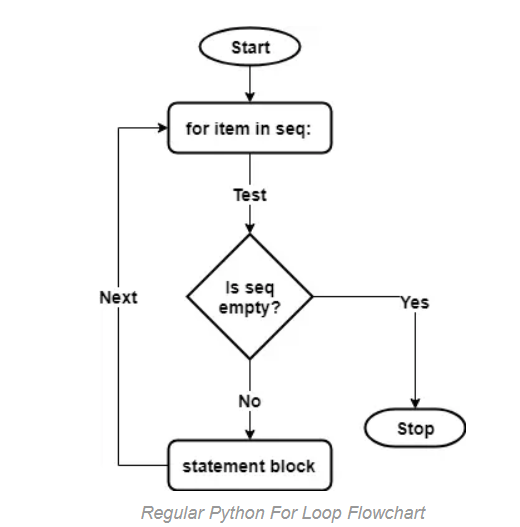
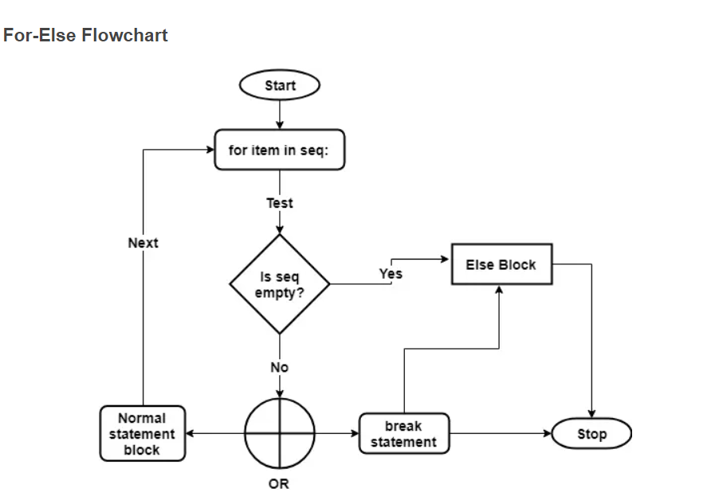

# Day13- Python For loop

- most preferred control flow statement to be used in a Python program.
- A for loop in Python requires at least two variables to work. The first is the iterable object such as a list, tuple or a string. And second is the variable to store the successive values from the sequence in the loop.

### Syntax
>```python
>for iter in sequence:
>    statements(iter)
>```
> >Here, “iter” represents the iterating variable. It gets assigned with the successive values from the input sequence.   
> >The “sequence” may refer to any of the following Python objects such as a list, a tuple or a string.   


### Flow chart


## Iterate in string.
```python
my_str = 'Nepal'
for iter in my_str:
    print(iter)
```
Output:
```
N
e
p
a
l
```

## Iterate in Lists and finding average
```python
my_list = [1, 3, 5, 7, 9, 10]
sum = 0
for iter in my_list:
    sum += iter
print('Total sum: ', sum) 
print('Average: ', sum/len(my_list))  
```
Output:
```
Total sum:  35
Average:  5.833333333333333
```

## Range() function with For Loop
 - The range() function can produce an integer sequence at runtime. For example, a statement like range(0, 10) will generate a series of ten integers starting from 0 to 9.
```python
print(range(0,5)[3])
# output: 3
```
 ### Iterate in Range()
```python
for iter in range(0, 5):
    print("iter:", (iter))
print('\n')
for iter in range(0, 5):
    print("iter: %d" %iter)
print('\n')
for iter in range(5):
    print(iter)    
```
Output:
```
iter: 0
iter: 1
iter: 2
iter: 3
iter: 4


iter: 0
iter: 1
iter: 2
iter: 3
iter: 4

0
1
2
3
4
```

By default, the “for” loop fetches elements from the sequence and assigns to the iterating variable. But you can also make the “for” loop returning the index by replacing the sequence with a range(len(seq)) expression.
```python
books = ['C', 'C++', 'Java', 'Python']
for index in range(len(books)):
   print('Book (%d):' %index, books[index])
```
Output:
```
Book (0): C
Book (1): C++
Book (2): Java
Book (3): Python
```

## Else Clause in For Loop

The code under the else clause executes after the completion of the “for” loop. However, if the loop stops due to a “break” call, then it’ll skip the “else” clause.

### Syntax
```python
for item in seq:
    statement 1
    statement 2
    if <cond>:
        break
else:
    statements
```

### Flowchart of For-else Loop:


```python
season = ['summer', 'spring', 'autum', 'winter']
ignoreElse = False

for iter in season:
    print(iter)
    if ignoreElse:
        break
else:
    print("No seasons left left.")
```

Output:
```
summer
spring
autum
winter
No seasons left left.
```