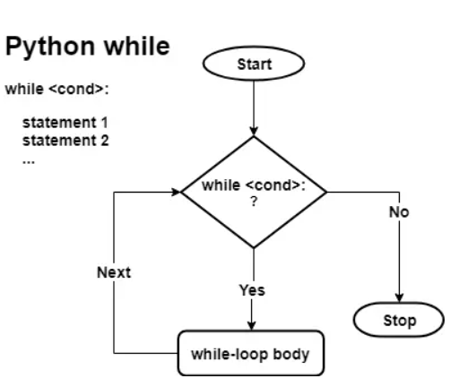

# Day14 - Python While Loop

A while loop is a control flow structure which repeatedly executes a block of code indefinite no. of times until the given condition becomes false. 

### Syntax 
```python
while some_condition (or expression) :
    a block of code
```
### Flowchart


#### Finding number of odd between given numbers using while- loop
```python
# taking inputs from user
r1 = int(input("Enter the starting range value?"))
r2 = int(input("Enter the ending range value?"))

num = r1 + 1
count = 0

while num < r2:
    if (num % 2) > 0:
        count += 1
    num += 1

print("Odd count: %d" % (count))
```
Output:
```
Enter the starting range value?
Enter the ending range value?100
Odd count: 45
```

## Else clause with Python While Loop
In Python, we can add an optional else clause after the end of “while” loop.

The code inside the else clause would always run but after the while loop finishes execution. The one situation when it won’t run is if the loop exits after a “break” statement.

Using the else clause would make sense when we wish to execute a set of instructions after the while loop ends, i.e., without using a break statement.     


*Kindly refer the below example*
```python
count = 0
while count < 5 :
    num = int(input("Enter number between 0-100?"))
    if (num < 0) or (num > 100):
        print("Aborted while: You've entered an invalid number.")
        break
    count += 1
else:
    print("While loop ended gracefully.")
```
Output1: *if input num is between 0-100:*
```
Enter number between 0-100?3
Enter number between 0-100?5
Enter number between 0-100?2 
Enter number between 0-100?6
Enter number between 0-100?2
While loop ended gracefully.
```
Output2: *if input num is out of range(0-100)*
```
Enter number between 0-100?111
Aborted while: You've entered an invalid number.
```

