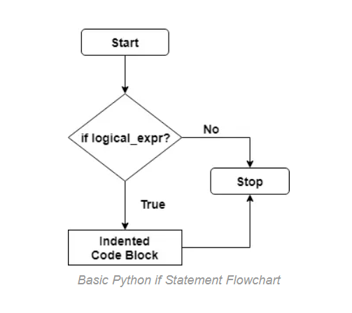
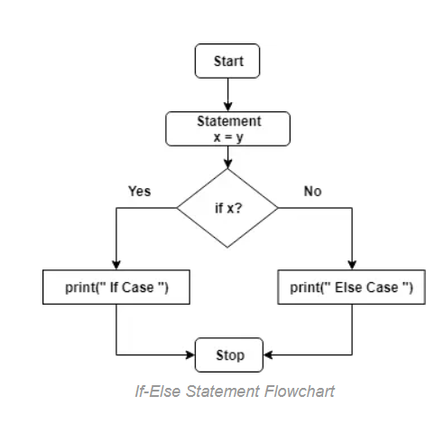

# Day15 - Python If statement, If Elif Else, Nested If

It executes the underlying code only if the result is True.

### syntax
```python
if Logical_Expression :
    Indented Code Block
```

### Flowchart



```python
days = int(input("How many days in a leap year? "))
if days == 366:
    print("You are inside if-statement")
print("Now! You are outside the if-statement")
```
Output1: *if input number is 366*
```
How many days in a leap year? 366
You are inside if-statement
Now! You are outside the if-statement
```
Output2: *if input number is not 366*
```
How many days in a leap year? 365
Now! You are outside the if-statement
```

## Python if Else Statement

If the result is True, then the code block following the expression would run. Otherwise, the code indented under the else clause would execute.

### Syntax
```python
if Logical_Expression :
    Indented Code Block 1
else :
    Indented Code Block 2
```
### flowchart



## Python If Else in One Line
```python
value_on_true if condition else value_on_false
```

## Python if-Elif-Else Statement
```python
if Logical_Expression_1 :
    Indented Code Block 1
elif Logical_Expression_2 :
    Indented Code Block 2
elif Logical_Expression_3 :
    Indented Code Block 3
...
else :
    Indented Code Block N
```

### flowchart


## Python Nested-if statement
```python
if Logical_Expression_1 :
    if Logical_Expression_1.1 :
        if Logical_Expression_1.1.1 :
            Indented Code Block 1.1.1
        else
            Indented Code Block
    elif Logical_Expression_1.2 :
        Indented Code Block 1.2
    else :
        Indented Code Block
elif Logical_Expression_2 :
    Indented Code Block 2
elif Logical_Expression_3 :
    Indented Code Block 3
...
else :
    Indented Code Block
```

### Flowchart
