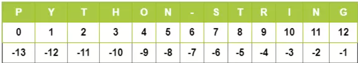

# Python String

Creating strings is easy as you only need to enclose the characters either in single or double-quotes.
One can create string using triple quotes also. However, programmers use them to mark multi-line strings and docstrings. 
```python
# Python string with single quote
var_string = 'Learning'
print(var_string)
var_string = 'Suneel'
print(var_string)

#python string with double quote
string_var = "Covid"
print(string_var)
string_var = "over"
print(string_var)

# String with triple quotes.
str_variable = """This document will be helpful
to explore 
python 
strings!!!
Keep Learning"""
print(str_variable)
```

Output: 
``` -- None -- 
Learning
Suneel
Covid
over
This document will be helpful
to explore 
python 
strings!!!
Keep Learning
```

Replace the word from string. 
```python
# String with triple quotes.
str_variable = """This document will be helpful
to explore 
python 
strings!!!
Keep Learning"""
print(str_variable)

# Replace word from string.
str_variable = str_variable.replace("document", "page")
print(str_variable)
```

Output: 
``` -- None -- 
This document will be helpful
to explore 
python 
strings!!!
Keep Learning
This page will be helpful
to explore 
python 
strings!!!
Keep Learning
```

## Index and Slice string in Python

### Access individual characters in a string
Like most programming languages, Python allows to index from the zeroth position in Strings. But it also supports negative indexes. Index of ‘-1’ represents the last character of the String. Similarly, using ‘-2’, we can access the penultimate element of the string and so on. 
 

```python
Sample_str = 'Python-String'
print(Sample_str[0])    # return 1st character

print(Sample_str[-1])   # return last character

print(Sample_str[-2])   # return second-last character
```

### Slice a string

To retrieve a range of characters in a String, we use ‘slicing operator,’ the colon ‘:’ sign. With the slicing operator, we define the range as [a:b]. It’ll let us print all the characters of the String starting from index ‘a’ up to char at index ‘b-1’. So the char at index ‘b’ is not a part of the output.
```python
sample_str = 'Python String'
print (sample_str[3:5])	    #return a range of character
# ho
print (sample_str[7:])      # return all characters from index 7
# String
print (sample_str[:6])      # return all characters before index 6
# Python
print (sample_str[7:-4])
# St
```

## Other String Operators in Python
1. Concatenation(+)  
    It combines to strings into one.
    ```python
     var1 = 'Suneel'
     var2 = 'Tajpuriya'
     print(var1+var2)
     #output: Suneel Tajpuriya
    ```
2. Repetition(\*)   
 This operator creates a new string by repeating it a given number of times.
    ```python
    var1 = 'Suneel '
    print(var1*3)
    #Suneel Suneel Suneel
    ```
3. Membership(in)  
This operator returns 'True' value if the character is present in the given string. 
    ```python
    var1 = 'Suneel'
    print('u' in var1)
    #True
    print('U' in var1)
    #False
    ```
4. Membership( not in)
    ```python
    var1 = 'Suneel'
    print('U' not in var1)
    # True
    ```
5. Iterating(for)  
With this operator, we can iterate through all the characters of a string. 
    ```python
    var1 = 'Suneel'
    for i in var1:
        print(i)
    print('next for loop')
    for i in var1:
        print(i, end="")
    ```
    Output: 
    ``` -- None -- 
    S
    u
    n
    e
    e
    l
    next for loop
    Suneel
    ```
6. Raw String(r/R)  
we can use it to ignore the actual meaning of Escape characters inside a string. For this, we add 'r' or 'R' in front of the string.
    ```python
    # if you want to print \n
    print(r'\n')
    # \n
    print(R'\n')
    # \n
    ```
### Some examples in python string

1. Printing: Nepal is "beautiful" country in the world. 
    ```python
    print('Nepal is "beautiful" country in the world')
    print("Nepal is \"beautiful\" country in the world")
    ``` 
2. Print in format: 
    ```python
    print("Student Name: %s, \nStudent Roll: %d" % ('Suneel', 88))
    ```
    Output: 
    ``` -- None -- 
    Student Name: Suneel,
    Student Roll: 88
    ```
List of Format Symbols:  
``` -- None -- 
%c	 Character
%s	 String
%i	 Signed decimal integer
%d 	 Signed decimal integer
%u	 Unsigned decimal integer
%o	 octal integer
%x	hexadecimal integer (lowercase letters)
%X	hexadecimal integer (UPPER-case letters)
%e	exponential notation (with lowercase ‘e’)
%E	exponential notation (with UPPER-case ‘E’)
%f	floating-point real number
%g	the shorter of %f and %e
%G	the shorter of %f and %E
```
### Unicode String Support in python
Regular Strings stores as the 8-bit ASCII value, whereas Unicode String follows the 16-bit ASCII standard. This extension allows the strings to include characters from the different languages of the world. In Python, the letter ‘u’ works as a prefix to distinguish between Unicode and usual strings.
```python
print (u' Hello Python!!')

#Hello Python
```
